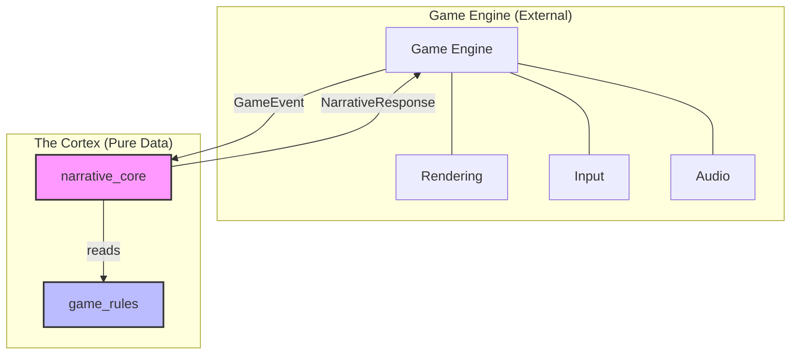
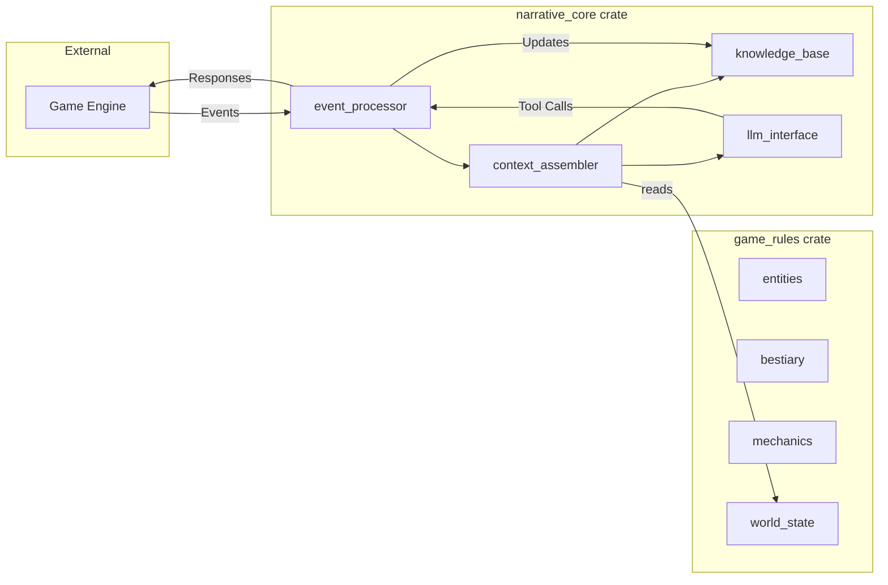
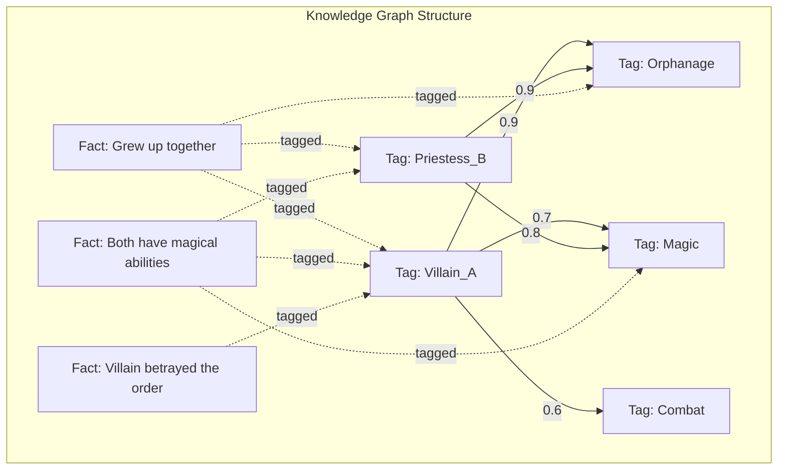
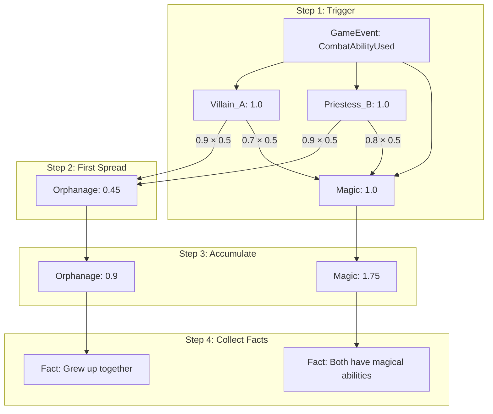
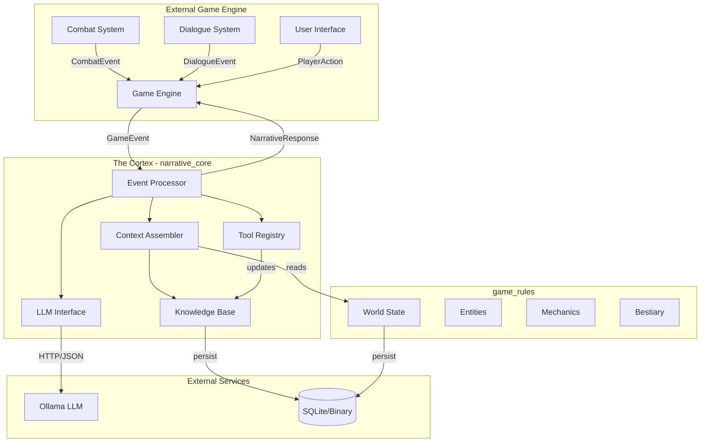
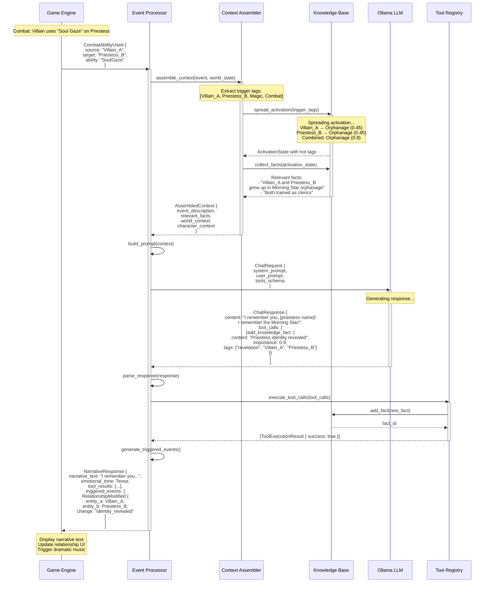
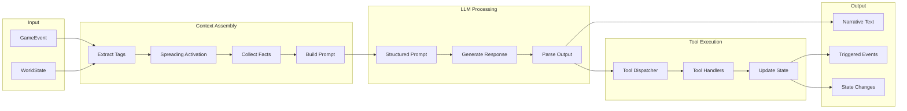
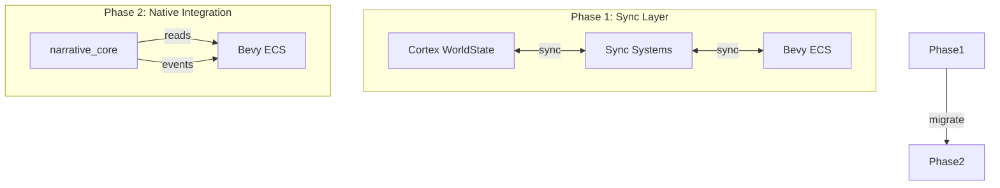

# The Cortex: Architectural Document

## Emergent Narrative System for AI-Driven RPG

**Version:** 1.0
**Date:** December 2024

---

## Table of Contents

1. [General Concept and Design Philosophy](#part-1-general-concept-and-design-philosophy)
2. [Architecture of Two Crates](#part-2-architecture-of-two-crates)
3. [Interaction and Data Flow](#part-3-interaction-and-data-flow)
4. [Final Recommendations](#part-4-final-recommendations)

---

## Part 1: General Concept and Design Philosophy

### 1.1 Vision

The Cortex is an autonomous core for managing dynamic narrative, memory, and AI interaction in RPGs. It serves as the "brain" of emergent storytelling - a system where narrative emerges naturally from the interplay of game state, accumulated knowledge, and AI-generated responses.

### 1.2 Core Design Principles

#### 1.2.1 State-Driven Architecture

All AI actions must result from analysis of current world state and accumulated memory. The system never generates content in isolation - every narrative output is grounded in:

- Current `WorldState` (character positions, time, weather, ongoing events)
- Historical facts stored in the `KnowledgeBase`
- Active relationships and their emotional states
- Recent events that provide immediate context

```rust
/// The fundamental principle: AI decisions are pure functions of state
fn generate_narrative(
    world_state: &WorldState,
    knowledge: &KnowledgeGraph,
    event: &GameEvent,
) -> NarrativeOutput {
    // All inputs are explicit - no hidden state
}
```

#### 1.2.2 Event-Driven Communication

The core reacts to external events rather than controlling the game loop. This separation ensures:

- **Loose coupling**: The game engine controls timing and flow
- **Responsiveness**: Events are processed asynchronously
- **Flexibility**: Any game engine can integrate with the core

```rust
/// Events flow INTO the core, responses flow OUT
pub trait EventProcessor {
    fn process_event(&mut self, event: GameEvent) -> Vec<NarrativeResponse>;
}
```

#### 1.2.3 Extensibility Through Traits and Enums

The architecture uses Rust's type system to enable extension without modification:

```rust
/// New fact types can be added by extending this enum
#[derive(Debug, Clone, Serialize, Deserialize)]
pub enum FactType {
    Relationship(RelationshipFact),
    Event(EventFact),
    Secret(SecretFact),
    Custom(Box<dyn CustomFact>),
}

/// New tools can be added by implementing this trait
pub trait Tool: Send + Sync {
    fn name(&self) -> &str;
    fn description(&self) -> &str;
    fn schema(&self) -> JsonSchema;
    fn execute(&self, params: Value) -> Result<ToolResult, ToolError>;
}
```

#### 1.2.4 Decoupled from Rendering

The core operates on pure data - it has no knowledge of:

- Graphics rendering
- Input handling
- Audio systems
- Network protocols

This separation is visualized in the following diagram:



### 1.3 Architectural Overview



---

## Part 2: Architecture of Two Crates

### 2.1 Crate #1: `game_rules` (The World Bible)

This crate is the "skeleton" of the world - containing all rules, mechanics, and data, but no AI logic. It serves as the single source of truth for game state.

#### 2.1.1 Module: `entities`

**Purpose:** Define all game entities using a component-based data architecture.

```rust
// src/entities/mod.rs

use serde::{Deserialize, Serialize};
use std::collections::HashMap;
use uuid::Uuid;

/// Unique identifier for all entities
#[derive(Debug, Clone, Copy, PartialEq, Eq, Hash, Serialize, Deserialize)]
pub struct EntityId(pub Uuid);

impl EntityId {
    pub fn new() -> Self {
        Self(Uuid::new_v4())
    }
}

/// Base entity structure - holds components by type
#[derive(Debug, Clone, Serialize, Deserialize)]
pub struct Entity {
    pub id: EntityId,
    pub name: String,
    pub entity_type: EntityType,
    components: HashMap<ComponentType, Box<dyn Component>>,
}

#[derive(Debug, Clone, PartialEq, Eq, Hash, Serialize, Deserialize)]
pub enum EntityType {
    Character,
    Creature,
    Item,
    Location,
}

#[derive(Debug, Clone, PartialEq, Eq, Hash, Serialize, Deserialize)]
pub enum ComponentType {
    Stats,
    Inventory,
    StatusEffects,
    Position,
    Dialogue,
    Combat,
}
```

**Component Definitions:**

```rust
// src/entities/components.rs

use serde::{Deserialize, Serialize};

/// Stats component for characters and creatures
#[derive(Debug, Clone, Serialize, Deserialize)]
pub struct StatsComponent {
    pub strength: i32,
    pub dexterity: i32,
    pub constitution: i32,
    pub intelligence: i32,
    pub wisdom: i32,
    pub charisma: i32,

    pub current_hp: i32,
    pub max_hp: i32,
    pub current_mana: i32,
    pub max_mana: i32,
}

impl StatsComponent {
    pub fn modifier(&self, stat: StatType) -> i32 {
        let value = match stat {
            StatType::Strength => self.strength,
            StatType::Dexterity => self.dexterity,
            StatType::Constitution => self.constitution,
            StatType::Intelligence => self.intelligence,
            StatType::Wisdom => self.wisdom,
            StatType::Charisma => self.charisma,
        };
        (value - 10) / 2
    }
}

/// Inventory component
#[derive(Debug, Clone, Serialize, Deserialize)]
pub struct InventoryComponent {
    pub items: Vec<ItemStack>,
    pub capacity: usize,
    pub equipped: HashMap<EquipmentSlot, EntityId>,
}

#[derive(Debug, Clone, Serialize, Deserialize)]
pub struct ItemStack {
    pub item_id: EntityId,
    pub quantity: u32,
}

/// Status effects currently active on an entity
#[derive(Debug, Clone, Serialize, Deserialize)]
pub struct StatusEffectComponent {
    pub active_effects: Vec<ActiveStatusEffect>,
}

#[derive(Debug, Clone, Serialize, Deserialize)]
pub struct ActiveStatusEffect {
    pub effect_type: StatusEffectType,
    pub remaining_duration: Option<u32>, // None = permanent
    pub stacks: u32,
    pub source: Option<EntityId>,
}
```

**Character Structure:**

```rust
// src/entities/character.rs

use super::*;

/// Full character definition with all relevant components
#[derive(Debug, Clone, Serialize, Deserialize)]
pub struct Character {
    pub id: EntityId,
    pub name: String,
    pub title: Option<String>,

    // Core components stored directly for frequent access
    pub stats: StatsComponent,
    pub inventory: InventoryComponent,
    pub status_effects: StatusEffectComponent,

    // Additional components in a flexible map
    #[serde(default)]
    pub extra_components: HashMap<String, serde_json::Value>,

    // Character-specific data
    pub backstory: Option<String>,
    pub personality_traits: Vec<String>,
    pub current_goal: Option<String>,
    pub faction_allegiances: HashMap<String, i32>, // faction_id -> reputation
}

impl Character {
    pub fn new(name: impl Into<String>) -> Self {
        Self {
            id: EntityId::new(),
            name: name.into(),
            title: None,
            stats: StatsComponent::default(),
            inventory: InventoryComponent::default(),
            status_effects: StatusEffectComponent::default(),
            extra_components: HashMap::new(),
            backstory: None,
            personality_traits: Vec::new(),
            current_goal: None,
            faction_allegiances: HashMap::new(),
        }
    }

    pub fn is_alive(&self) -> bool {
        self.stats.current_hp > 0
    }

    pub fn has_status(&self, effect: StatusEffectType) -> bool {
        self.status_effects.active_effects
            .iter()
            .any(|e| e.effect_type == effect)
    }
}
```

#### 2.1.2 Module: `bestiary`

**Purpose:** Define creature templates that can be instantiated during gameplay.

```rust
// src/bestiary/mod.rs

use serde::{Deserialize, Serialize};
use crate::entities::*;
use crate::mechanics::*;

/// Template for creating creature instances
/// Loaded from external configuration files (TOML/JSON)
#[derive(Debug, Clone, Serialize, Deserialize)]
pub struct CreatureTemplate {
    /// Unique template identifier (e.g., "goblin_warrior")
    pub id: String,

    /// Display name for this creature type
    pub name: String,

    /// Category for organization and AI behavior
    pub category: CreatureCategory,

    /// Base statistics (can be modified by difficulty scaling)
    pub base_stats: StatsComponent,

    /// Challenge rating for encounter balancing
    pub challenge_rating: f32,

    /// Abilities this creature can use
    pub abilities: Vec<AbilityTemplate>,

    /// Loot table reference
    pub loot_table: Option<String>,

    /// AI behavior hints
    pub behavior: CreatureBehavior,

    /// Tags for knowledge base integration
    pub tags: Vec<String>,

    /// Narrative description for LLM context
    pub description: String,
}

#[derive(Debug, Clone, Serialize, Deserialize)]
pub enum CreatureCategory {
    Humanoid,
    Beast,
    Undead,
    Demon,
    Elemental,
    Construct,
    Dragon,
    Aberration,
}

#[derive(Debug, Clone, Serialize, Deserialize)]
pub struct CreatureBehavior {
    /// How aggressive is this creature? (0.0 - 1.0)
    pub aggression: f32,
    /// Will it flee when wounded?
    pub flee_threshold: Option<f32>,
    /// Preferred combat range
    pub preferred_range: CombatRange,
    /// Social behavior
    pub pack_behavior: bool,
}

#[derive(Debug, Clone, Serialize, Deserialize)]
pub struct AbilityTemplate {
    pub id: String,
    pub name: String,
    pub cooldown: u32,
    pub damage_type: Option<DamageType>,
    pub effects: Vec<StatusEffectType>,
}
```

**Template Loading:**

```rust
// src/bestiary/loader.rs

use std::path::Path;
use std::fs;

pub struct BestiaryLoader;

impl BestiaryLoader {
    /// Load all creature templates from a directory
    pub fn load_from_directory(path: &Path) -> Result<Bestiary, LoadError> {
        let mut templates = HashMap::new();

        for entry in fs::read_dir(path)? {
            let entry = entry?;
            let path = entry.path();

            if path.extension().map_or(false, |e| e == "toml") {
                let content = fs::read_to_string(&path)?;
                let template: CreatureTemplate = toml::from_str(&content)?;
                templates.insert(template.id.clone(), template);
            }
        }

        Ok(Bestiary { templates })
    }
}

/// Runtime bestiary containing all loaded templates
#[derive(Debug, Clone)]
pub struct Bestiary {
    templates: HashMap<String, CreatureTemplate>,
}

impl Bestiary {
    /// Instantiate a creature from a template
    pub fn spawn(&self, template_id: &str, name: Option<String>) -> Option<Creature> {
        let template = self.templates.get(template_id)?;

        Some(Creature {
            id: EntityId::new(),
            template_id: template_id.to_string(),
            name: name.unwrap_or_else(|| template.name.clone()),
            stats: template.base_stats.clone(),
            status_effects: StatusEffectComponent::default(),
            current_abilities: template.abilities.iter()
                .map(|a| ActiveAbility::from_template(a))
                .collect(),
        })
    }
}
```

**Example TOML Template:**

```toml
# data/bestiary/goblin_warrior.toml

id = "goblin_warrior"
name = "Goblin Warrior"
category = "Humanoid"
challenge_rating = 0.25
description = "A small, green-skinned creature wielding a rusty shortsword. Goblins are cowardly alone but dangerous in groups."

tags = ["goblin", "humanoid", "tribal", "cowardly"]

[base_stats]
strength = 8
dexterity = 14
constitution = 10
intelligence = 8
wisdom = 8
charisma = 6
max_hp = 7
current_hp = 7
max_mana = 0
current_mana = 0

[behavior]
aggression = 0.3
flee_threshold = 0.25
preferred_range = "Melee"
pack_behavior = true

[[abilities]]
id = "shortsword_attack"
name = "Shortsword"
cooldown = 0
damage_type = "Slashing"
effects = []

[[abilities]]
id = "nimble_escape"
name = "Nimble Escape"
cooldown = 1
effects = []

loot_table = "goblin_common"
```

#### 2.1.3 Module: `mechanics`

**Purpose:** Define game rules, damage types, skill checks, and status effects.

```rust
// src/mechanics/mod.rs

use serde::{Deserialize, Serialize};

/// All possible damage types in the system
#[derive(Debug, Clone, Copy, PartialEq, Eq, Hash, Serialize, Deserialize)]
pub enum DamageType {
    // Physical
    Slashing,
    Piercing,
    Bludgeoning,

    // Elemental
    Fire,
    Cold,
    Lightning,
    Acid,

    // Magical
    Radiant,
    Necrotic,
    Force,
    Psychic,

    // Special
    Poison,
    True, // Bypasses all resistances
}

/// Status effects that can be applied to entities
#[derive(Debug, Clone, Copy, PartialEq, Eq, Hash, Serialize, Deserialize)]
pub enum StatusEffectType {
    // Damage over time
    Bleeding,
    Poisoned,
    Burning,

    // Control
    Stunned,
    Paralyzed,
    Frightened,
    Charmed,

    // Debuffs
    Weakened,
    Slowed,
    Blinded,
    Deafened,

    // Buffs
    Blessed,
    Hasted,
    Invisible,
    Protected,

    // Special
    Unconscious,
    Dead,
}

/// Skill check types for narrative and mechanical resolution
#[derive(Debug, Clone, Serialize, Deserialize)]
pub struct SkillCheck {
    pub skill: SkillType,
    pub difficulty_class: u32,
    pub modifiers: Vec<CheckModifier>,
}

#[derive(Debug, Clone, Copy, PartialEq, Eq, Hash, Serialize, Deserialize)]
pub enum SkillType {
    // Strength-based
    Athletics,

    // Dexterity-based
    Acrobatics,
    SleightOfHand,
    Stealth,

    // Intelligence-based
    Arcana,
    History,
    Investigation,
    Nature,
    Religion,

    // Wisdom-based
    AnimalHandling,
    Insight,
    Medicine,
    Perception,
    Survival,

    // Charisma-based
    Deception,
    Intimidation,
    Performance,
    Persuasion,
}

#[derive(Debug, Clone, Serialize, Deserialize)]
pub struct CheckModifier {
    pub source: String,
    pub value: i32,
    pub reason: String,
}

/// Combat range categories
#[derive(Debug, Clone, Copy, PartialEq, Eq, Serialize, Deserialize)]
pub enum CombatRange {
    Melee,
    Close,  // 5-15 feet
    Medium, // 15-60 feet
    Long,   // 60-120 feet
    Extreme, // 120+ feet
}

/// Equipment slots for characters
#[derive(Debug, Clone, Copy, PartialEq, Eq, Hash, Serialize, Deserialize)]
pub enum EquipmentSlot {
    Head,
    Chest,
    Hands,
    Legs,
    Feet,
    MainHand,
    OffHand,
    Neck,
    Ring1,
    Ring2,
}
```

**Damage Calculation System:**

```rust
// src/mechanics/damage.rs

/// Result of damage calculation
#[derive(Debug, Clone, Serialize, Deserialize)]
pub struct DamageResult {
    pub base_damage: i32,
    pub damage_type: DamageType,
    pub resistances_applied: Vec<ResistanceApplication>,
    pub final_damage: i32,
    pub is_critical: bool,
}

#[derive(Debug, Clone, Serialize, Deserialize)]
pub struct ResistanceApplication {
    pub resistance_type: ResistanceType,
    pub modifier: f32,
    pub source: String,
}

#[derive(Debug, Clone, Copy, PartialEq, Serialize, Deserialize)]
pub enum ResistanceType {
    Vulnerable, // 2x damage
    Normal,     // 1x damage
    Resistant,  // 0.5x damage
    Immune,     // 0x damage
}

/// Calculate final damage after applying resistances
pub fn calculate_damage(
    base_damage: i32,
    damage_type: DamageType,
    target_resistances: &HashMap<DamageType, ResistanceType>,
    is_critical: bool,
) -> DamageResult {
    let mut damage = base_damage;
    let mut applications = Vec::new();

    if is_critical {
        damage *= 2;
    }

    let resistance = target_resistances
        .get(&damage_type)
        .copied()
        .unwrap_or(ResistanceType::Normal);

    let modifier = match resistance {
        ResistanceType::Vulnerable => 2.0,
        ResistanceType::Normal => 1.0,
        ResistanceType::Resistant => 0.5,
        ResistanceType::Immune => 0.0,
    };

    applications.push(ResistanceApplication {
        resistance_type: resistance,
        modifier,
        source: format!("{:?} resistance", damage_type),
    });

    let final_damage = (damage as f32 * modifier).floor() as i32;

    DamageResult {
        base_damage,
        damage_type,
        resistances_applied: applications,
        final_damage,
        is_critical,
    }
}
```

#### 2.1.4 Module: `world_state`

**Purpose:** Central structure aggregating all game data, fully serializable.

```rust
// src/world_state/mod.rs

use serde::{Deserialize, Serialize};
use std::collections::HashMap;
use crate::entities::*;

/// The complete state of the game world at any point in time
#[derive(Debug, Clone, Serialize, Deserialize)]
pub struct WorldState {
    /// Global time tracking
    pub time: WorldTime,

    /// Current weather and environmental conditions
    pub environment: EnvironmentState,

    /// All characters in the world (including player)
    pub characters: HashMap<EntityId, Character>,

    /// All active creatures
    pub creatures: HashMap<EntityId, Creature>,

    /// All items in the world (not in inventories)
    pub world_items: HashMap<EntityId, WorldItem>,

    /// Location data
    pub locations: HashMap<LocationId, Location>,

    /// Current location of each entity
    pub entity_locations: HashMap<EntityId, LocationId>,

    /// Active quests and their states
    pub quests: HashMap<QuestId, QuestState>,

    /// Global flags and variables
    pub global_flags: HashMap<String, FlagValue>,

    /// Recent events for short-term context
    pub recent_events: Vec<TimestampedEvent>,
}

#[derive(Debug, Clone, Copy, Serialize, Deserialize)]
pub struct WorldTime {
    pub day: u32,
    pub hour: u8,
    pub minute: u8,
    pub season: Season,
}

#[derive(Debug, Clone, Copy, PartialEq, Eq, Serialize, Deserialize)]
pub enum Season {
    Spring,
    Summer,
    Autumn,
    Winter,
}

#[derive(Debug, Clone, Serialize, Deserialize)]
pub struct EnvironmentState {
    pub weather: Weather,
    pub temperature: i32, // Celsius
    pub visibility: Visibility,
    pub ambient_danger_level: f32, // 0.0 - 1.0
}

#[derive(Debug, Clone, Copy, PartialEq, Eq, Serialize, Deserialize)]
pub enum Weather {
    Clear,
    Cloudy,
    Rainy,
    Stormy,
    Snowy,
    Foggy,
}

#[derive(Debug, Clone, Copy, Serialize, Deserialize)]
pub enum Visibility {
    Bright,
    Normal,
    Dim,
    Dark,
    MagicalDarkness,
}

#[derive(Debug, Clone, Copy, PartialEq, Eq, Hash, Serialize, Deserialize)]
pub struct LocationId(pub Uuid);

#[derive(Debug, Clone, Serialize, Deserialize)]
pub struct Location {
    pub id: LocationId,
    pub name: String,
    pub description: String,
    pub location_type: LocationType,
    pub connected_locations: Vec<LocationId>,
    pub ambient_tags: Vec<String>, // For knowledge base integration
}

#[derive(Debug, Clone, Copy, PartialEq, Eq, Serialize, Deserialize)]
pub enum LocationType {
    Wilderness,
    Town,
    Dungeon,
    Building,
    Special,
}

#[derive(Debug, Clone, Serialize, Deserialize)]
pub struct TimestampedEvent {
    pub time: WorldTime,
    pub event: GameEvent,
}

#[derive(Debug, Clone, Serialize, Deserialize)]
pub enum FlagValue {
    Bool(bool),
    Int(i64),
    Float(f64),
    String(String),
}
```

**World State Queries:**

```rust
// src/world_state/queries.rs

impl WorldState {
    /// Get all entities at a specific location
    pub fn entities_at_location(&self, location_id: LocationId) -> Vec<EntityId> {
        self.entity_locations
            .iter()
            .filter(|(_, loc)| **loc == location_id)
            .map(|(entity, _)| *entity)
            .collect()
    }

    /// Get character by ID
    pub fn get_character(&self, id: EntityId) -> Option<&Character> {
        self.characters.get(&id)
    }

    /// Get mutable character by ID
    pub fn get_character_mut(&mut self, id: EntityId) -> Option<&mut Character> {
        self.characters.get_mut(&id)
    }

    /// Check if it's currently night
    pub fn is_night(&self) -> bool {
        self.time.hour < 6 || self.time.hour >= 20
    }

    /// Get the danger level at current location
    pub fn current_danger_level(&self, entity_id: EntityId) -> f32 {
        let base_danger = self.environment.ambient_danger_level;

        // Increase danger at night
        let time_modifier = if self.is_night() { 0.2 } else { 0.0 };

        // Increase danger in bad weather
        let weather_modifier = match self.environment.weather {
            Weather::Stormy => 0.15,
            Weather::Foggy => 0.1,
            _ => 0.0,
        };

        (base_danger + time_modifier + weather_modifier).min(1.0)
    }

    /// Advance time by given minutes
    pub fn advance_time(&mut self, minutes: u32) {
        let total_minutes = self.time.minute as u32 + minutes;
        self.time.minute = (total_minutes % 60) as u8;

        let hours_passed = total_minutes / 60;
        let total_hours = self.time.hour as u32 + hours_passed;
        self.time.hour = (total_hours % 24) as u8;

        let days_passed = total_hours / 24;
        self.time.day += days_passed;

        // Update season every 90 days
        let season_day = self.time.day % 360;
        self.time.season = match season_day {
            0..=89 => Season::Spring,
            90..=179 => Season::Summer,
            180..=269 => Season::Autumn,
            _ => Season::Winter,
        };
    }
}
```

---

### 2.2 Crate #2: `narrative_core` (The Cortex)

This crate is the "brain" of the system - it interfaces with `game_rules`, communicates with LLMs, and manages narrative generation.

#### 2.2.1 Module: `knowledge_base`

**Purpose:** Long-term memory storage using an associative knowledge graph.



**Tag and Fact Definitions:**

```rust
// src/knowledge_base/types.rs

use serde::{Deserialize, Serialize};
use std::collections::{HashMap, HashSet};
use uuid::Uuid;

/// Tags are the nodes in our knowledge graph
/// They represent concepts, entities, locations, or themes
#[derive(Debug, Clone, PartialEq, Eq, Hash, Serialize, Deserialize)]
pub enum Tag {
    /// Reference to a specific entity
    Entity(EntityId),

    /// A location in the world
    Location(LocationId),

    /// A concept or theme
    Concept(String),

    /// A faction or organization
    Faction(String),

    /// An event type
    EventType(String),

    /// A relationship type
    RelationType(String),

    /// Custom tag for extension
    Custom(String),
}

impl Tag {
    pub fn as_string(&self) -> String {
        match self {
            Tag::Entity(id) => format!("entity:{}", id.0),
            Tag::Location(id) => format!("location:{}", id.0),
            Tag::Concept(s) => format!("concept:{}", s),
            Tag::Faction(s) => format!("faction:{}", s),
            Tag::EventType(s) => format!("event:{}", s),
            Tag::RelationType(s) => format!("relation:{}", s),
            Tag::Custom(s) => format!("custom:{}", s),
        }
    }
}

/// Unique identifier for facts
#[derive(Debug, Clone, Copy, PartialEq, Eq, Hash, Serialize, Deserialize)]
pub struct FactId(pub Uuid);

/// A fact is a piece of knowledge stored in the graph
#[derive(Debug, Clone, Serialize, Deserialize)]
pub struct Fact {
    pub id: FactId,

    /// Human-readable content of the fact
    pub content: String,

    /// Type of fact for filtering and processing
    pub fact_type: FactType,

    /// Tags this fact is associated with
    pub tags: HashSet<Tag>,

    /// When this fact was added (game time)
    pub timestamp: WorldTime,

    /// Importance score (0.0 - 1.0) for prioritization
    pub importance: f32,

    /// Whether this fact is known to the player
    pub known_to_player: bool,

    /// Whether this fact has been "revealed" in narrative
    pub revealed: bool,

    /// Optional expiration (for temporary facts)
    pub expires_at: Option<WorldTime>,

    /// Source of this fact
    pub source: FactSource,
}

#[derive(Debug, Clone, Serialize, Deserialize)]
pub enum FactType {
    /// Relationship between two entities
    Relationship {
        entity_a: EntityId,
        entity_b: EntityId,
        relationship: RelationshipType,
        sentiment: f32, // -1.0 to 1.0
    },

    /// A historical event
    Event {
        description: String,
        participants: Vec<EntityId>,
        location: Option<LocationId>,
    },

    /// A secret that could be revealed
    Secret {
        holder: EntityId,
        severity: SecretSeverity,
    },

    /// Character trait or personality note
    Trait {
        entity: EntityId,
        trait_name: String,
    },

    /// World lore
    Lore {
        category: String,
    },

    /// Quest-related information
    Quest {
        quest_id: QuestId,
    },

    /// Generic/custom fact
    Generic,
}

#[derive(Debug, Clone, Copy, Serialize, Deserialize)]
pub enum RelationshipType {
    Family,
    Friend,
    Enemy,
    Romantic,
    Professional,
    Rival,
    Mentor,
}

#[derive(Debug, Clone, Copy, Serialize, Deserialize)]
pub enum SecretSeverity {
    Minor,      // Embarrassing
    Moderate,   // Damaging to reputation
    Major,      // Life-changing
    Critical,   // Deadly consequences
}

#[derive(Debug, Clone, Serialize, Deserialize)]
pub enum FactSource {
    Initial,           // Part of initial game setup
    LLMGenerated,      // Created by AI during play
    PlayerAction,      // Result of player choice
    WorldEvent,        // Triggered by game mechanics
    DialogueRevealed,  // Revealed through conversation
}
```

**Knowledge Graph Structure:**

```rust
// src/knowledge_base/graph.rs

use super::types::*;
use std::collections::{HashMap, HashSet};
use serde::{Deserialize, Serialize};

/// Association between two tags with a weight
#[derive(Debug, Clone, Serialize, Deserialize)]
pub struct Association {
    pub target: Tag,
    pub weight: f32, // 0.0 - 1.0
    pub association_type: AssociationType,
}

#[derive(Debug, Clone, Copy, Serialize, Deserialize)]
pub enum AssociationType {
    Direct,      // Explicitly defined
    CoOccurrence, // Both tags appear on same facts
    Semantic,    // Conceptually related
    Temporal,    // Related in time
}

/// The main knowledge graph structure
#[derive(Debug, Clone, Serialize, Deserialize)]
pub struct KnowledgeGraph {
    /// All facts stored by ID
    facts: HashMap<FactId, Fact>,

    /// Index: Tag -> Facts containing this tag
    tag_to_facts: HashMap<Tag, HashSet<FactId>>,

    /// Associations between tags (adjacency list)
    associations: HashMap<Tag, Vec<Association>>,

    /// Reverse index for efficient lookups
    fact_by_entity: HashMap<EntityId, HashSet<FactId>>,
}

impl KnowledgeGraph {
    pub fn new() -> Self {
        Self {
            facts: HashMap::new(),
            tag_to_facts: HashMap::new(),
            associations: HashMap::new(),
            fact_by_entity: HashMap::new(),
        }
    }

    /// Add a new fact to the knowledge base
    pub fn add_fact(&mut self, fact: Fact) -> FactId {
        let id = fact.id;

        // Index by tags
        for tag in &fact.tags {
            self.tag_to_facts
                .entry(tag.clone())
                .or_insert_with(HashSet::new)
                .insert(id);
        }

        // Index by entity references
        if let FactType::Relationship { entity_a, entity_b, .. } = &fact.fact_type {
            self.fact_by_entity
                .entry(*entity_a)
                .or_insert_with(HashSet::new)
                .insert(id);
            self.fact_by_entity
                .entry(*entity_b)
                .or_insert_with(HashSet::new)
                .insert(id);
        }

        self.facts.insert(id, fact);
        id
    }

    /// Get all facts associated with a tag
    pub fn facts_by_tag(&self, tag: &Tag) -> Vec<&Fact> {
        self.tag_to_facts
            .get(tag)
            .map(|ids| {
                ids.iter()
                    .filter_map(|id| self.facts.get(id))
                    .collect()
            })
            .unwrap_or_default()
    }

    /// Add or update an association between tags
    pub fn add_association(&mut self, from: Tag, to: Tag, weight: f32, assoc_type: AssociationType) {
        let associations = self.associations.entry(from).or_insert_with(Vec::new);

        // Update existing or add new
        if let Some(existing) = associations.iter_mut().find(|a| a.target == to) {
            existing.weight = (existing.weight + weight) / 2.0; // Average weights
        } else {
            associations.push(Association {
                target: to,
                weight,
                association_type: assoc_type,
            });
        }
    }

    /// Get all associations for a tag
    pub fn get_associations(&self, tag: &Tag) -> &[Association] {
        self.associations
            .get(tag)
            .map(|v| v.as_slice())
            .unwrap_or(&[])
    }

    /// Get fact by ID
    pub fn get_fact(&self, id: FactId) -> Option<&Fact> {
        self.facts.get(&id)
    }

    /// Mark a fact as revealed
    pub fn reveal_fact(&mut self, id: FactId) -> bool {
        if let Some(fact) = self.facts.get_mut(&id) {
            fact.revealed = true;
            true
        } else {
            false
        }
    }

    /// Get unrevealed secrets for an entity
    pub fn unrevealed_secrets(&self, entity: EntityId) -> Vec<&Fact> {
        self.fact_by_entity
            .get(&entity)
            .map(|ids| {
                ids.iter()
                    .filter_map(|id| self.facts.get(id))
                    .filter(|fact| {
                        matches!(fact.fact_type, FactType::Secret { .. }) && !fact.revealed
                    })
                    .collect()
            })
            .unwrap_or_default()
    }
}
```

**Persistence Layer:**

```rust
// src/knowledge_base/storage.rs

use super::graph::KnowledgeGraph;
use std::path::Path;
use std::fs;

/// Storage interface for the knowledge graph
pub trait KnowledgeStorage {
    fn save(&self, graph: &KnowledgeGraph) -> Result<(), StorageError>;
    fn load(&self) -> Result<KnowledgeGraph, StorageError>;
}

/// Binary file storage using bincode
pub struct BinaryStorage {
    path: PathBuf,
}

impl BinaryStorage {
    pub fn new(path: impl Into<PathBuf>) -> Self {
        Self { path: path.into() }
    }
}

impl KnowledgeStorage for BinaryStorage {
    fn save(&self, graph: &KnowledgeGraph) -> Result<(), StorageError> {
        let encoded = bincode::serialize(graph)?;
        fs::write(&self.path, encoded)?;
        Ok(())
    }

    fn load(&self) -> Result<KnowledgeGraph, StorageError> {
        let data = fs::read(&self.path)?;
        let graph = bincode::deserialize(&data)?;
        Ok(graph)
    }
}

/// SQLite storage for more complex querying
pub struct SqliteStorage {
    connection: rusqlite::Connection,
}

impl SqliteStorage {
    pub fn new(path: impl AsRef<Path>) -> Result<Self, StorageError> {
        let connection = rusqlite::Connection::open(path)?;

        // Initialize schema
        connection.execute_batch(r#"
            CREATE TABLE IF NOT EXISTS facts (
                id TEXT PRIMARY KEY,
                content TEXT NOT NULL,
                fact_type TEXT NOT NULL,
                importance REAL NOT NULL,
                known_to_player INTEGER NOT NULL,
                revealed INTEGER NOT NULL,
                timestamp TEXT NOT NULL,
                data BLOB NOT NULL
            );

            CREATE TABLE IF NOT EXISTS tags (
                fact_id TEXT NOT NULL,
                tag TEXT NOT NULL,
                PRIMARY KEY (fact_id, tag),
                FOREIGN KEY (fact_id) REFERENCES facts(id)
            );

            CREATE TABLE IF NOT EXISTS associations (
                from_tag TEXT NOT NULL,
                to_tag TEXT NOT NULL,
                weight REAL NOT NULL,
                assoc_type TEXT NOT NULL,
                PRIMARY KEY (from_tag, to_tag)
            );

            CREATE INDEX IF NOT EXISTS idx_tags_tag ON tags(tag);
            CREATE INDEX IF NOT EXISTS idx_facts_importance ON facts(importance);
        "#)?;

        Ok(Self { connection })
    }
}
```

#### 2.2.2 Module: `context_assembler`

**Purpose:** Build context for LLM prompts using spreading activation algorithm.

```rust
// src/context_assembler/mod.rs

use crate::knowledge_base::{KnowledgeGraph, Tag, Fact};
use crate::game_rules::world_state::WorldState;
use std::collections::HashMap;

/// Configuration for the spreading activation algorithm
#[derive(Debug, Clone)]
pub struct ActivationConfig {
    /// Initial energy given to trigger tags
    pub initial_energy: f32,

    /// How much energy decays at each step
    pub decay_rate: f32,

    /// Maximum depth of spreading
    pub max_depth: u32,

    /// Minimum energy threshold for inclusion
    pub energy_threshold: f32,

    /// Maximum number of facts to include
    pub max_facts: usize,
}

impl Default for ActivationConfig {
    fn default() -> Self {
        Self {
            initial_energy: 1.0,
            decay_rate: 0.5,
            max_depth: 2,
            energy_threshold: 0.1,
            max_facts: 20,
        }
    }
}

/// Tracks activation energy for tags during spreading
#[derive(Debug, Clone)]
pub struct ActivationState {
    energies: HashMap<Tag, f32>,
}

impl ActivationState {
    pub fn new() -> Self {
        Self {
            energies: HashMap::new(),
        }
    }

    pub fn add_energy(&mut self, tag: Tag, energy: f32) {
        let current = self.energies.entry(tag).or_insert(0.0);
        *current += energy;
    }

    pub fn get_energy(&self, tag: &Tag) -> f32 {
        self.energies.get(tag).copied().unwrap_or(0.0)
    }

    pub fn hot_tags(&self, threshold: f32) -> Vec<(&Tag, f32)> {
        let mut tags: Vec<_> = self.energies
            .iter()
            .filter(|(_, energy)| **energy >= threshold)
            .map(|(tag, energy)| (tag, *energy))
            .collect();

        tags.sort_by(|a, b| b.1.partial_cmp(&a.1).unwrap());
        tags
    }
}

/// The context assembler builds prompts from knowledge and state
pub struct ContextAssembler {
    config: ActivationConfig,
}

impl ContextAssembler {
    pub fn new(config: ActivationConfig) -> Self {
        Self { config }
    }

    /// Run spreading activation algorithm
    ///
    /// Algorithm steps:
    /// 1. Initialize trigger tags with initial energy
    /// 2. For each depth level:
    ///    a. For each active tag, spread energy to associated tags
    ///    b. Apply decay to all energies
    /// 3. Collect all tags above threshold
    pub fn spread_activation(
        &self,
        graph: &KnowledgeGraph,
        trigger_tags: Vec<Tag>,
    ) -> ActivationState {
        let mut state = ActivationState::new();

        // Step 1: Initialize trigger tags
        for tag in trigger_tags {
            state.add_energy(tag, self.config.initial_energy);
        }

        // Step 2: Spread activation
        for _depth in 0..self.config.max_depth {
            let mut new_energies: HashMap<Tag, f32> = HashMap::new();

            for (tag, energy) in &state.energies {
                if *energy < self.config.energy_threshold {
                    continue;
                }

                // Spread to associated tags
                for assoc in graph.get_associations(tag) {
                    let spread_energy = energy * assoc.weight * self.config.decay_rate;
                    *new_energies.entry(assoc.target.clone()).or_insert(0.0) += spread_energy;
                }
            }

            // Merge new energies
            for (tag, energy) in new_energies {
                state.add_energy(tag, energy);
            }
        }

        state
    }

    /// Collect relevant facts based on activation state
    pub fn collect_facts<'a>(
        &self,
        graph: &'a KnowledgeGraph,
        activation: &ActivationState,
    ) -> Vec<&'a Fact> {
        let hot_tags = activation.hot_tags(self.config.energy_threshold);

        let mut fact_scores: HashMap<FactId, f32> = HashMap::new();

        // Score facts by sum of their tag energies
        for (tag, energy) in hot_tags {
            for fact in graph.facts_by_tag(tag) {
                *fact_scores.entry(fact.id).or_insert(0.0) += energy * fact.importance;
            }
        }

        // Sort by score and take top N
        let mut scored_facts: Vec<_> = fact_scores.into_iter().collect();
        scored_facts.sort_by(|a, b| b.1.partial_cmp(&a.1).unwrap());

        scored_facts
            .into_iter()
            .take(self.config.max_facts)
            .filter_map(|(id, _)| graph.get_fact(id))
            .collect()
    }

    /// Assemble complete context for LLM prompt
    pub fn assemble_context(
        &self,
        event: &GameEvent,
        graph: &KnowledgeGraph,
        world_state: &WorldState,
    ) -> AssembledContext {
        // Extract trigger tags from event
        let trigger_tags = self.extract_tags_from_event(event, world_state);

        // Run spreading activation
        let activation = self.spread_activation(graph, trigger_tags);

        // Collect relevant facts
        let facts = self.collect_facts(graph, &activation);

        // Build context sections
        AssembledContext {
            event_description: self.describe_event(event),
            relevant_facts: facts.iter().map(|f| f.content.clone()).collect(),
            world_context: self.extract_world_context(world_state, event),
            character_context: self.extract_character_context(world_state, event),
            activated_tags: activation.hot_tags(self.config.energy_threshold)
                .into_iter()
                .map(|(t, e)| (t.clone(), e))
                .collect(),
        }
    }

    fn extract_tags_from_event(&self, event: &GameEvent, world_state: &WorldState) -> Vec<Tag> {
        let mut tags = Vec::new();

        match event {
            GameEvent::CombatAbilityUsed { source, target, ability } => {
                tags.push(Tag::Entity(*source));
                tags.push(Tag::Entity(*target));
                tags.push(Tag::Concept("Combat".to_string()));
                tags.push(Tag::Concept(ability.clone()));
            }
            GameEvent::DialogueStarted { participants, .. } => {
                for p in participants {
                    tags.push(Tag::Entity(*p));
                }
                tags.push(Tag::Concept("Dialogue".to_string()));
            }
            GameEvent::LocationEntered { entity, location } => {
                tags.push(Tag::Entity(*entity));
                tags.push(Tag::Location(*location));
            }
            // ... handle other event types
            _ => {}
        }

        // Add current location tag
        if let Some(entity_id) = event.primary_entity() {
            if let Some(loc_id) = world_state.entity_locations.get(&entity_id) {
                tags.push(Tag::Location(*loc_id));
            }
        }

        tags
    }

    fn describe_event(&self, event: &GameEvent) -> String {
        // Convert event to human-readable description for LLM
        match event {
            GameEvent::CombatAbilityUsed { source, target, ability } => {
                format!("Entity {} used ability '{}' on entity {}",
                    source.0, ability, target.0)
            }
            // ... other event types
            _ => format!("{:?}", event),
        }
    }

    fn extract_world_context(&self, world_state: &WorldState, _event: &GameEvent) -> WorldContext {
        WorldContext {
            time_of_day: format!("{:02}:{:02}", world_state.time.hour, world_state.time.minute),
            day: world_state.time.day,
            season: world_state.time.season,
            weather: world_state.environment.weather,
            is_night: world_state.is_night(),
        }
    }

    fn extract_character_context(&self, world_state: &WorldState, event: &GameEvent) -> Vec<CharacterContext> {
        event.involved_entities()
            .iter()
            .filter_map(|id| world_state.get_character(*id))
            .map(|c| CharacterContext {
                name: c.name.clone(),
                title: c.title.clone(),
                current_hp_percent: (c.stats.current_hp as f32 / c.stats.max_hp as f32 * 100.0) as u32,
                active_statuses: c.status_effects.active_effects
                    .iter()
                    .map(|e| format!("{:?}", e.effect_type))
                    .collect(),
                personality: c.personality_traits.clone(),
            })
            .collect()
    }
}

/// The assembled context ready for prompt generation
#[derive(Debug, Clone)]
pub struct AssembledContext {
    pub event_description: String,
    pub relevant_facts: Vec<String>,
    pub world_context: WorldContext,
    pub character_context: Vec<CharacterContext>,
    pub activated_tags: Vec<(Tag, f32)>,
}

#[derive(Debug, Clone)]
pub struct WorldContext {
    pub time_of_day: String,
    pub day: u32,
    pub season: Season,
    pub weather: Weather,
    pub is_night: bool,
}

#[derive(Debug, Clone)]
pub struct CharacterContext {
    pub name: String,
    pub title: Option<String>,
    pub current_hp_percent: u32,
    pub active_statuses: Vec<String>,
    pub personality: Vec<String>,
}
```

**Spreading Activation Visualization:**



#### 2.2.3 Module: `llm_interface`

**Purpose:** Communicate with LLM (Ollama) and manage tool definitions.

```rust
// src/llm_interface/mod.rs

use async_trait::async_trait;
use serde::{Deserialize, Serialize};
use serde_json::{json, Value};

/// Trait for defining tools that the LLM can call
#[async_trait]
pub trait Tool: Send + Sync {
    /// Unique name of the tool
    fn name(&self) -> &str;

    /// Description for the LLM
    fn description(&self) -> &str;

    /// JSON Schema for parameters
    fn parameter_schema(&self) -> Value;

    /// Execute the tool with given parameters
    async fn execute(&self, params: Value) -> Result<ToolResult, ToolError>;
}

/// Result of tool execution
#[derive(Debug, Clone, Serialize, Deserialize)]
pub struct ToolResult {
    pub success: bool,
    pub message: String,
    pub data: Option<Value>,
}

/// Error during tool execution
#[derive(Debug, Clone)]
pub struct ToolError {
    pub code: String,
    pub message: String,
}

/// Tool registry for managing available tools
pub struct ToolRegistry {
    tools: HashMap<String, Box<dyn Tool>>,
}

impl ToolRegistry {
    pub fn new() -> Self {
        Self {
            tools: HashMap::new(),
        }
    }

    pub fn register(&mut self, tool: Box<dyn Tool>) {
        self.tools.insert(tool.name().to_string(), tool);
    }

    pub fn get(&self, name: &str) -> Option<&dyn Tool> {
        self.tools.get(name).map(|t| t.as_ref())
    }

    /// Generate JSON schema for all tools (for system prompt)
    pub fn generate_schema(&self) -> Value {
        let tools: Vec<Value> = self.tools.values().map(|tool| {
            json!({
                "type": "function",
                "function": {
                    "name": tool.name(),
                    "description": tool.description(),
                    "parameters": tool.parameter_schema()
                }
            })
        }).collect();

        json!({ "tools": tools })
    }
}
```

**Example Tool Implementation:**

```rust
// src/llm_interface/tools/add_knowledge_fact.rs

use super::*;

/// Tool for adding new facts to the knowledge base
pub struct AddKnowledgeFactTool {
    knowledge_base: Arc<RwLock<KnowledgeGraph>>,
}

impl AddKnowledgeFactTool {
    pub fn new(knowledge_base: Arc<RwLock<KnowledgeGraph>>) -> Self {
        Self { knowledge_base }
    }
}

#[async_trait]
impl Tool for AddKnowledgeFactTool {
    fn name(&self) -> &str {
        "add_knowledge_fact"
    }

    fn description(&self) -> &str {
        "Add a new fact to the narrative memory. Use this when important story \
         information is revealed or when relationships between characters change. \
         Facts will be remembered and may influence future narrative generation."
    }

    fn parameter_schema(&self) -> Value {
        json!({
            "type": "object",
            "properties": {
                "content": {
                    "type": "string",
                    "description": "The fact content in natural language"
                },
                "importance": {
                    "type": "number",
                    "minimum": 0.0,
                    "maximum": 1.0,
                    "description": "How important is this fact (0.0-1.0)"
                },
                "tags": {
                    "type": "array",
                    "items": { "type": "string" },
                    "description": "Related concepts, character names, or locations"
                },
                "is_secret": {
                    "type": "boolean",
                    "description": "Whether this is a secret not known to the player"
                }
            },
            "required": ["content", "importance", "tags"]
        })
    }

    async fn execute(&self, params: Value) -> Result<ToolResult, ToolError> {
        let content = params["content"].as_str()
            .ok_or_else(|| ToolError {
                code: "MISSING_CONTENT".to_string(),
                message: "content parameter is required".to_string(),
            })?;

        let importance = params["importance"].as_f64()
            .unwrap_or(0.5) as f32;

        let tags: Vec<String> = params["tags"].as_array()
            .map(|arr| arr.iter().filter_map(|v| v.as_str().map(String::from)).collect())
            .unwrap_or_default();

        let is_secret = params["is_secret"].as_bool().unwrap_or(false);

        // Create the fact
        let fact = Fact {
            id: FactId(Uuid::new_v4()),
            content: content.to_string(),
            fact_type: if is_secret {
                FactType::Secret {
                    holder: EntityId(Uuid::nil()), // Would need entity reference
                    severity: SecretSeverity::Moderate,
                }
            } else {
                FactType::Generic
            },
            tags: tags.into_iter().map(|t| Tag::Concept(t)).collect(),
            timestamp: WorldTime::default(),
            importance,
            known_to_player: !is_secret,
            revealed: false,
            expires_at: None,
            source: FactSource::LLMGenerated,
        };

        // Add to knowledge base
        let mut kb = self.knowledge_base.write().await;
        let fact_id = kb.add_fact(fact);

        Ok(ToolResult {
            success: true,
            message: format!("Added fact with ID {}", fact_id.0),
            data: Some(json!({ "fact_id": fact_id.0.to_string() })),
        })
    }
}

/// Tool for modifying relationship between entities
pub struct ModifyRelationshipTool {
    knowledge_base: Arc<RwLock<KnowledgeGraph>>,
}

#[async_trait]
impl Tool for ModifyRelationshipTool {
    fn name(&self) -> &str {
        "modify_relationship"
    }

    fn description(&self) -> &str {
        "Update the relationship between two characters. Use this when \
         interactions significantly change how characters view each other."
    }

    fn parameter_schema(&self) -> Value {
        json!({
            "type": "object",
            "properties": {
                "entity_a": {
                    "type": "string",
                    "description": "Name or ID of the first character"
                },
                "entity_b": {
                    "type": "string",
                    "description": "Name or ID of the second character"
                },
                "relationship_type": {
                    "type": "string",
                    "enum": ["Friend", "Enemy", "Neutral", "Rival", "Ally", "Romantic"],
                    "description": "The new relationship type"
                },
                "sentiment_change": {
                    "type": "number",
                    "minimum": -1.0,
                    "maximum": 1.0,
                    "description": "How much sentiment changed (-1 to +1)"
                },
                "reason": {
                    "type": "string",
                    "description": "Why this relationship changed"
                }
            },
            "required": ["entity_a", "entity_b", "relationship_type", "reason"]
        })
    }

    async fn execute(&self, params: Value) -> Result<ToolResult, ToolError> {
        // Implementation would look up entities and update relationship facts
        Ok(ToolResult {
            success: true,
            message: "Relationship updated".to_string(),
            data: None,
        })
    }
}
```

**Ollama API Client:**

```rust
// src/llm_interface/ollama.rs

use reqwest::Client;
use tokio::sync::mpsc;

/// Configuration for Ollama connection
#[derive(Debug, Clone)]
pub struct OllamaConfig {
    pub base_url: String,
    pub model: String,
    pub temperature: f32,
    pub max_tokens: u32,
    pub timeout_seconds: u64,
}

impl Default for OllamaConfig {
    fn default() -> Self {
        Self {
            base_url: "http://localhost:11434".to_string(),
            model: "llama3.1".to_string(),
            temperature: 0.7,
            max_tokens: 2048,
            timeout_seconds: 60,
        }
    }
}

/// Ollama API client
pub struct OllamaClient {
    client: Client,
    config: OllamaConfig,
}

impl OllamaClient {
    pub fn new(config: OllamaConfig) -> Self {
        let client = Client::builder()
            .timeout(Duration::from_secs(config.timeout_seconds))
            .build()
            .expect("Failed to create HTTP client");

        Self { client, config }
    }

    /// Send a chat completion request
    pub async fn chat(&self, request: ChatRequest) -> Result<ChatResponse, LLMError> {
        let url = format!("{}/api/chat", self.config.base_url);

        let body = json!({
            "model": self.config.model,
            "messages": request.messages,
            "options": {
                "temperature": self.config.temperature,
                "num_predict": self.config.max_tokens,
            },
            "tools": request.tools,
            "stream": false
        });

        let response = self.client
            .post(&url)
            .json(&body)
            .send()
            .await
            .map_err(|e| LLMError::NetworkError(e.to_string()))?;

        if !response.status().is_success() {
            return Err(LLMError::ApiError(
                response.text().await.unwrap_or_default()
            ));
        }

        let result: OllamaResponse = response.json().await
            .map_err(|e| LLMError::ParseError(e.to_string()))?;

        Ok(ChatResponse {
            content: result.message.content,
            tool_calls: result.message.tool_calls.unwrap_or_default(),
        })
    }
}

/// Chat request structure
#[derive(Debug, Clone, Serialize)]
pub struct ChatRequest {
    pub messages: Vec<ChatMessage>,
    pub tools: Option<Value>,
}

#[derive(Debug, Clone, Serialize, Deserialize)]
pub struct ChatMessage {
    pub role: String,
    pub content: String,
}

/// Chat response structure
#[derive(Debug, Clone)]
pub struct ChatResponse {
    pub content: String,
    pub tool_calls: Vec<ToolCall>,
}

#[derive(Debug, Clone, Deserialize)]
pub struct ToolCall {
    pub function: FunctionCall,
}

#[derive(Debug, Clone, Deserialize)]
pub struct FunctionCall {
    pub name: String,
    pub arguments: Value,
}

/// Internal Ollama response format
#[derive(Debug, Deserialize)]
struct OllamaResponse {
    message: OllamaMessage,
}

#[derive(Debug, Deserialize)]
struct OllamaMessage {
    content: String,
    tool_calls: Option<Vec<ToolCall>>,
}

#[derive(Debug)]
pub enum LLMError {
    NetworkError(String),
    ApiError(String),
    ParseError(String),
    Timeout,
}
```

#### 2.2.4 Module: `event_processor`

**Purpose:** Process LLM responses and dispatch tool calls.

```rust
// src/event_processor/mod.rs

use crate::context_assembler::{AssembledContext, ContextAssembler};
use crate::knowledge_base::KnowledgeGraph;
use crate::llm_interface::{OllamaClient, ChatRequest, ChatMessage, ToolRegistry, ToolCall};

/// The main event processor - orchestrates the narrative pipeline
pub struct EventProcessor {
    context_assembler: ContextAssembler,
    llm_client: OllamaClient,
    tool_registry: ToolRegistry,
    knowledge_base: Arc<RwLock<KnowledgeGraph>>,
}

impl EventProcessor {
    pub fn new(
        context_assembler: ContextAssembler,
        llm_client: OllamaClient,
        tool_registry: ToolRegistry,
        knowledge_base: Arc<RwLock<KnowledgeGraph>>,
    ) -> Self {
        Self {
            context_assembler,
            llm_client,
            tool_registry,
            knowledge_base,
        }
    }

    /// Process a game event and generate narrative response
    pub async fn process_event(
        &mut self,
        event: GameEvent,
        world_state: &WorldState,
    ) -> Result<NarrativeResponse, ProcessingError> {
        // Step 1: Assemble context
        let kb = self.knowledge_base.read().await;
        let context = self.context_assembler.assemble_context(&event, &kb, world_state);
        drop(kb);

        // Step 2: Build prompt
        let prompt = self.build_prompt(&context);

        // Step 3: Call LLM
        let request = ChatRequest {
            messages: vec![
                ChatMessage {
                    role: "system".to_string(),
                    content: self.system_prompt(),
                },
                ChatMessage {
                    role: "user".to_string(),
                    content: prompt,
                },
            ],
            tools: Some(self.tool_registry.generate_schema()),
        };

        let response = self.llm_client.chat(request).await
            .map_err(|e| ProcessingError::LLMError(format!("{:?}", e)))?;

        // Step 4: Parse response
        let parsed = self.parse_response(&response)?;

        // Step 5: Execute tool calls
        let tool_results = self.execute_tool_calls(&response.tool_calls).await?;

        // Step 6: Build final response
        Ok(NarrativeResponse {
            narrative_text: parsed.narrative_text,
            suggested_actions: parsed.suggested_actions,
            emotional_tone: parsed.emotional_tone,
            tool_results,
            triggered_events: self.generate_triggered_events(&tool_results),
        })
    }

    fn system_prompt(&self) -> String {
        r#"You are the narrative engine for an RPG game. Your role is to:
1. Generate immersive narrative text for game events
2. Track important story developments using the provided tools
3. Create meaningful character interactions
4. Maintain consistency with established facts

When generating narrative:
- Be dramatic and engaging
- Reference relevant history when appropriate
- Create opportunities for character development
- Signal important revelations through tool calls

Available tools allow you to:
- Add new facts to story memory
- Modify character relationships
- Flag events as significant

Always respond with narrative text first, then any tool calls."#.to_string()
    }

    fn build_prompt(&self, context: &AssembledContext) -> String {
        let mut prompt = String::new();

        prompt.push_str("## Current Event\n");
        prompt.push_str(&context.event_description);
        prompt.push_str("\n\n");

        prompt.push_str("## World State\n");
        prompt.push_str(&format!(
            "Time: {} (Day {}), {} {}\n",
            context.world_context.time_of_day,
            context.world_context.day,
            if context.world_context.is_night { "Night" } else { "Day" },
            format!("{:?}", context.world_context.weather)
        ));
        prompt.push_str("\n");

        if !context.character_context.is_empty() {
            prompt.push_str("## Involved Characters\n");
            for char in &context.character_context {
                prompt.push_str(&format!(
                    "- {}{}: HP {}%, Conditions: {}\n",
                    char.name,
                    char.title.as_ref().map(|t| format!(", {}", t)).unwrap_or_default(),
                    char.current_hp_percent,
                    if char.active_statuses.is_empty() {
                        "None".to_string()
                    } else {
                        char.active_statuses.join(", ")
                    }
                ));
            }
            prompt.push_str("\n");
        }

        if !context.relevant_facts.is_empty() {
            prompt.push_str("## Relevant Background\n");
            for fact in &context.relevant_facts {
                prompt.push_str(&format!("- {}\n", fact));
            }
            prompt.push_str("\n");
        }

        prompt.push_str("Generate narrative text for this event. If this reveals important information or changes relationships, use the appropriate tools.\n");

        prompt
    }

    fn parse_response(&self, response: &ChatResponse) -> Result<ParsedResponse, ProcessingError> {
        // Extract narrative text (everything before tool calls)
        let content = &response.content;

        // Simple parsing - could be enhanced with structured output
        let narrative_text = content.trim().to_string();

        Ok(ParsedResponse {
            narrative_text,
            suggested_actions: Vec::new(),
            emotional_tone: self.analyze_tone(&narrative_text),
        })
    }

    async fn execute_tool_calls(
        &self,
        tool_calls: &[ToolCall],
    ) -> Result<Vec<ToolExecutionResult>, ProcessingError> {
        let mut results = Vec::new();

        for call in tool_calls {
            let tool_name = &call.function.name;
            let params = &call.function.arguments;

            match self.tool_registry.get(tool_name) {
                Some(tool) => {
                    match tool.execute(params.clone()).await {
                        Ok(result) => {
                            results.push(ToolExecutionResult {
                                tool_name: tool_name.clone(),
                                success: result.success,
                                message: result.message,
                                data: result.data,
                            });
                        }
                        Err(e) => {
                            results.push(ToolExecutionResult {
                                tool_name: tool_name.clone(),
                                success: false,
                                message: e.message,
                                data: None,
                            });
                        }
                    }
                }
                None => {
                    results.push(ToolExecutionResult {
                        tool_name: tool_name.clone(),
                        success: false,
                        message: format!("Unknown tool: {}", tool_name),
                        data: None,
                    });
                }
            }
        }

        Ok(results)
    }

    fn analyze_tone(&self, text: &str) -> EmotionalTone {
        // Simple heuristic analysis - could be enhanced
        let lowercase = text.to_lowercase();

        if lowercase.contains("death") || lowercase.contains("die") || lowercase.contains("blood") {
            EmotionalTone::Dark
        } else if lowercase.contains("laugh") || lowercase.contains("joy") || lowercase.contains("happy") {
            EmotionalTone::Light
        } else if lowercase.contains("tension") || lowercase.contains("fear") || lowercase.contains("danger") {
            EmotionalTone::Tense
        } else {
            EmotionalTone::Neutral
        }
    }

    fn generate_triggered_events(&self, tool_results: &[ToolExecutionResult]) -> Vec<GameEvent> {
        let mut events = Vec::new();

        for result in tool_results {
            if result.success {
                match result.tool_name.as_str() {
                    "modify_relationship" => {
                        // Could generate RelationshipModified event
                        if let Some(data) = &result.data {
                            // Parse and create event
                        }
                    }
                    "add_knowledge_fact" => {
                        // Could generate FactRevealed event
                    }
                    _ => {}
                }
            }
        }

        events
    }
}

/// Parsed LLM response
#[derive(Debug)]
struct ParsedResponse {
    narrative_text: String,
    suggested_actions: Vec<String>,
    emotional_tone: EmotionalTone,
}

/// Result of tool execution
#[derive(Debug, Clone, Serialize)]
pub struct ToolExecutionResult {
    pub tool_name: String,
    pub success: bool,
    pub message: String,
    pub data: Option<Value>,
}

/// Emotional tone of narrative
#[derive(Debug, Clone, Copy, PartialEq, Eq, Serialize)]
pub enum EmotionalTone {
    Dark,
    Light,
    Tense,
    Romantic,
    Mysterious,
    Neutral,
}

/// The complete narrative response sent back to game engine
#[derive(Debug, Clone, Serialize)]
pub struct NarrativeResponse {
    /// Text to display to the player
    pub narrative_text: String,

    /// Suggested player actions (optional)
    pub suggested_actions: Vec<String>,

    /// Emotional tone for UI/audio hints
    pub emotional_tone: EmotionalTone,

    /// Results from any tool calls
    pub tool_results: Vec<ToolExecutionResult>,

    /// Events triggered by this narrative
    pub triggered_events: Vec<GameEvent>,
}

#[derive(Debug)]
pub enum ProcessingError {
    LLMError(String),
    ContextError(String),
    ToolError(String),
}
```

---

## Part 3: Interaction and Data Flow

### 3.1 High-Level Architecture Diagram



### 3.2 Sequence Diagram: Combat Revelation Scenario

The following sequence diagram illustrates the complete flow when a villain uses a special ability against a priestess and reveals their shared past.



### 3.3 Data Flow Diagram



### 3.4 Game Event Types

```rust
// src/events.rs

use serde::{Deserialize, Serialize};
use crate::game_rules::entities::EntityId;
use crate::game_rules::world_state::LocationId;

/// All possible game events that the narrative core can process
#[derive(Debug, Clone, Serialize, Deserialize)]
pub enum GameEvent {
    // Combat events
    CombatAbilityUsed {
        source: EntityId,
        target: EntityId,
        ability: String,
    },

    CombatStarted {
        participants: Vec<EntityId>,
        location: LocationId,
    },

    CombatEnded {
        victor: Option<EntityId>,
        participants: Vec<EntityId>,
    },

    EntityDamaged {
        entity: EntityId,
        damage: i32,
        source: Option<EntityId>,
    },

    EntityDied {
        entity: EntityId,
        killer: Option<EntityId>,
    },

    // Dialogue events
    DialogueStarted {
        participants: Vec<EntityId>,
        topic: Option<String>,
    },

    DialogueChoice {
        speaker: EntityId,
        choice: String,
        listeners: Vec<EntityId>,
    },

    DialogueEnded {
        participants: Vec<EntityId>,
    },

    // World events
    LocationEntered {
        entity: EntityId,
        location: LocationId,
    },

    LocationExited {
        entity: EntityId,
        location: LocationId,
    },

    ItemPickedUp {
        entity: EntityId,
        item: EntityId,
    },

    ItemUsed {
        entity: EntityId,
        item: EntityId,
        target: Option<EntityId>,
    },

    // Time events
    TimeAdvanced {
        old_time: WorldTime,
        new_time: WorldTime,
    },

    DayChanged {
        day: u32,
    },

    SeasonChanged {
        season: Season,
    },

    // Quest events
    QuestStarted {
        quest_id: QuestId,
        initiator: Option<EntityId>,
    },

    QuestObjectiveCompleted {
        quest_id: QuestId,
        objective_id: String,
    },

    QuestCompleted {
        quest_id: QuestId,
    },

    // Relationship events (generated by narrative core)
    RelationshipModified {
        entity_a: EntityId,
        entity_b: EntityId,
        old_sentiment: f32,
        new_sentiment: f32,
        reason: String,
    },

    SecretRevealed {
        fact_id: FactId,
        revealed_to: Vec<EntityId>,
    },

    // Custom event for extensibility
    Custom {
        event_type: String,
        data: serde_json::Value,
    },
}

impl GameEvent {
    /// Get the primary entity involved in this event
    pub fn primary_entity(&self) -> Option<EntityId> {
        match self {
            GameEvent::CombatAbilityUsed { source, .. } => Some(*source),
            GameEvent::EntityDamaged { entity, .. } => Some(*entity),
            GameEvent::EntityDied { entity, .. } => Some(*entity),
            GameEvent::DialogueStarted { participants, .. } => participants.first().copied(),
            GameEvent::LocationEntered { entity, .. } => Some(*entity),
            GameEvent::ItemPickedUp { entity, .. } => Some(*entity),
            _ => None,
        }
    }

    /// Get all entities involved in this event
    pub fn involved_entities(&self) -> Vec<EntityId> {
        match self {
            GameEvent::CombatAbilityUsed { source, target, .. } => vec![*source, *target],
            GameEvent::CombatStarted { participants, .. } => participants.clone(),
            GameEvent::CombatEnded { participants, .. } => participants.clone(),
            GameEvent::DialogueStarted { participants, .. } => participants.clone(),
            GameEvent::RelationshipModified { entity_a, entity_b, .. } => vec![*entity_a, *entity_b],
            _ => self.primary_entity().into_iter().collect(),
        }
    }

    /// Get tags for this event (used in context assembly)
    pub fn tags(&self) -> Vec<String> {
        let mut tags = Vec::new();

        match self {
            GameEvent::CombatAbilityUsed { ability, .. } => {
                tags.push("Combat".to_string());
                tags.push(ability.clone());
            }
            GameEvent::DialogueStarted { topic, .. } => {
                tags.push("Dialogue".to_string());
                if let Some(t) = topic {
                    tags.push(t.clone());
                }
            }
            GameEvent::EntityDied { .. } => {
                tags.push("Death".to_string());
                tags.push("Combat".to_string());
            }
            _ => {}
        }

        tags
    }
}
```

---

## Part 4: Final Recommendations

### 4.1 Configuration Management

The system should load configuration from a structured data directory:

```
/data
├── config/
│   ├── cortex.toml          # Main configuration
│   ├── llm.toml             # LLM settings
│   └── activation.toml      # Spreading activation params
├── bestiary/
│   ├── humanoids/
│   │   ├── goblin_warrior.toml
│   │   └── orc_chief.toml
│   └── beasts/
│       └── dire_wolf.toml
├── knowledge/
│   ├── initial_facts.json   # Starting knowledge
│   └── associations.json    # Initial tag associations
├── templates/
│   └── prompts/
│       ├── system.txt       # System prompt template
│       └── combat.txt       # Combat-specific prompt
└── saves/
    └── {save_name}/
        ├── world_state.bin
        └── knowledge.db
```

**Configuration Structure:**

```rust
// src/config.rs

use serde::Deserialize;

#[derive(Debug, Clone, Deserialize)]
pub struct CortexConfig {
    pub llm: LLMConfig,
    pub activation: ActivationConfig,
    pub storage: StorageConfig,
    pub logging: LoggingConfig,
}

#[derive(Debug, Clone, Deserialize)]
pub struct LLMConfig {
    pub provider: String, // "ollama", "openai", etc.
    pub base_url: String,
    pub model: String,
    pub temperature: f32,
    pub max_tokens: u32,
    pub timeout_seconds: u64,
}

#[derive(Debug, Clone, Deserialize)]
pub struct StorageConfig {
    pub save_directory: PathBuf,
    pub auto_save_interval_minutes: u32,
    pub knowledge_storage: String, // "binary" or "sqlite"
}

impl CortexConfig {
    pub fn load(path: impl AsRef<Path>) -> Result<Self, ConfigError> {
        let content = std::fs::read_to_string(path)?;
        let config: CortexConfig = toml::from_str(&content)?;
        Ok(config)
    }
}
```

**Example cortex.toml:**

```toml
# data/config/cortex.toml

[llm]
provider = "ollama"
base_url = "http://localhost:11434"
model = "llama3.1"
temperature = 0.7
max_tokens = 2048
timeout_seconds = 60

[activation]
initial_energy = 1.0
decay_rate = 0.5
max_depth = 2
energy_threshold = 0.1
max_facts = 20

[storage]
save_directory = "./saves"
auto_save_interval_minutes = 5
knowledge_storage = "sqlite"

[logging]
level = "info"
file = "./logs/cortex.log"
```

### 4.2 Testing Strategies

Given the non-deterministic nature of LLM interactions, testing requires a multi-layered approach:

#### 4.2.1 Unit Tests for Deterministic Components

```rust
// tests/knowledge_base_tests.rs

#[cfg(test)]
mod tests {
    use super::*;

    #[test]
    fn test_fact_addition() {
        let mut graph = KnowledgeGraph::new();

        let fact = Fact {
            id: FactId(Uuid::new_v4()),
            content: "Test fact".to_string(),
            fact_type: FactType::Generic,
            tags: [Tag::Concept("test".to_string())].into_iter().collect(),
            timestamp: WorldTime::default(),
            importance: 0.5,
            known_to_player: true,
            revealed: false,
            expires_at: None,
            source: FactSource::Initial,
        };

        let id = graph.add_fact(fact.clone());

        assert!(graph.get_fact(id).is_some());
        assert_eq!(graph.get_fact(id).unwrap().content, "Test fact");
    }

    #[test]
    fn test_spreading_activation() {
        let mut graph = KnowledgeGraph::new();

        // Setup test graph
        let tag_a = Tag::Concept("A".to_string());
        let tag_b = Tag::Concept("B".to_string());
        let tag_c = Tag::Concept("C".to_string());

        graph.add_association(tag_a.clone(), tag_b.clone(), 0.8, AssociationType::Direct);
        graph.add_association(tag_b.clone(), tag_c.clone(), 0.6, AssociationType::Direct);

        let assembler = ContextAssembler::new(ActivationConfig::default());
        let activation = assembler.spread_activation(&graph, vec![tag_a.clone()]);

        // Verify activation spread
        assert!(activation.get_energy(&tag_a) > 0.5);
        assert!(activation.get_energy(&tag_b) > 0.0);
        assert!(activation.get_energy(&tag_c) > 0.0);

        // Verify decay
        assert!(activation.get_energy(&tag_b) < activation.get_energy(&tag_a));
        assert!(activation.get_energy(&tag_c) < activation.get_energy(&tag_b));
    }
}
```

#### 4.2.2 Integration Tests with Mocked LLM

```rust
// tests/integration_tests.rs

use mockall::*;

#[automock]
#[async_trait]
pub trait LLMClient {
    async fn chat(&self, request: ChatRequest) -> Result<ChatResponse, LLMError>;
}

#[tokio::test]
async fn test_event_processing_with_tool_call() {
    // Create mock LLM that returns a known response
    let mut mock_llm = MockLLMClient::new();
    mock_llm.expect_chat()
        .returning(|_| Ok(ChatResponse {
            content: "The villain's eyes flash with recognition.".to_string(),
            tool_calls: vec![
                ToolCall {
                    function: FunctionCall {
                        name: "add_knowledge_fact".to_string(),
                        arguments: json!({
                            "content": "Identity revealed",
                            "importance": 0.9,
                            "tags": ["revelation"]
                        }),
                    },
                }
            ],
        }));

    // Setup processor with mock
    let processor = EventProcessor::with_mock_llm(mock_llm);

    // Process event
    let event = GameEvent::CombatAbilityUsed {
        source: EntityId::new(),
        target: EntityId::new(),
        ability: "SoulGaze".to_string(),
    };

    let result = processor.process_event(event, &WorldState::default()).await;

    assert!(result.is_ok());
    let response = result.unwrap();
    assert!(response.narrative_text.contains("recognition"));
    assert_eq!(response.tool_results.len(), 1);
    assert!(response.tool_results[0].success);
}
```

#### 4.2.3 Snapshot Testing for Prompts

```rust
// tests/prompt_tests.rs

use insta::assert_snapshot;

#[test]
fn test_combat_prompt_generation() {
    let context = AssembledContext {
        event_description: "Villain uses Soul Gaze on Priestess".to_string(),
        relevant_facts: vec![
            "They grew up together".to_string(),
            "Both trained in magic".to_string(),
        ],
        world_context: WorldContext {
            time_of_day: "14:30".to_string(),
            day: 42,
            season: Season::Autumn,
            weather: Weather::Cloudy,
            is_night: false,
        },
        character_context: vec![
            CharacterContext {
                name: "Lord Vexis".to_string(),
                title: Some("The Betrayer".to_string()),
                current_hp_percent: 100,
                active_statuses: vec![],
                personality: vec!["cruel".to_string(), "calculating".to_string()],
            },
        ],
        activated_tags: vec![],
    };

    let assembler = ContextAssembler::new(ActivationConfig::default());
    let prompt = assembler.build_prompt_string(&context);

    // Snapshot test ensures prompt format doesn't accidentally change
    assert_snapshot!(prompt);
}
```

#### 4.2.4 Property-Based Testing

```rust
// tests/property_tests.rs

use proptest::prelude::*;

proptest! {
    #[test]
    fn spreading_activation_energy_decreases(
        initial_energy in 0.1f32..1.0,
        decay_rate in 0.1f32..0.9,
    ) {
        let config = ActivationConfig {
            initial_energy,
            decay_rate,
            max_depth: 2,
            energy_threshold: 0.01,
            max_facts: 10,
        };

        let mut graph = KnowledgeGraph::new();
        let tag_a = Tag::Concept("A".to_string());
        let tag_b = Tag::Concept("B".to_string());
        graph.add_association(tag_a.clone(), tag_b.clone(), 1.0, AssociationType::Direct);

        let assembler = ContextAssembler::new(config);
        let activation = assembler.spread_activation(&graph, vec![tag_a.clone()]);

        // Property: spread energy is always less than source
        prop_assert!(activation.get_energy(&tag_b) <= activation.get_energy(&tag_a));
    }
}
```

### 4.3 Evolution with Bevy Integration

When integrating with Bevy ECS, the architecture can evolve in two phases:

#### Phase 1: WorldState Synchronization

Initially, keep `WorldState` as the primary data structure and synchronize with Bevy:

```rust
// bevy_integration/sync.rs

use bevy::prelude::*;
use game_rules::world_state::WorldState;

/// System that syncs Cortex WorldState with Bevy ECS
pub fn sync_world_state_to_bevy(
    cortex_state: Res<WorldState>,
    mut commands: Commands,
    query: Query<(Entity, &CortexEntityId)>,
) {
    for (entity, cortex_id) in query.iter() {
        if let Some(character) = cortex_state.get_character(cortex_id.0) {
            commands.entity(entity).insert(SyncedStats {
                hp: character.stats.current_hp,
                max_hp: character.stats.max_hp,
            });
        }
    }
}

/// System that syncs Bevy ECS changes back to Cortex
pub fn sync_bevy_to_world_state(
    mut cortex_state: ResMut<WorldState>,
    query: Query<(&CortexEntityId, &Transform), Changed<Transform>>,
) {
    for (cortex_id, transform) in query.iter() {
        if let Some(location) = world_position_to_location(transform.translation) {
            cortex_state.entity_locations.insert(cortex_id.0, location);
        }
    }
}
```

#### Phase 2: Native Bevy Components

Eventually, game_rules components can become Bevy components:

```rust
// bevy_integration/native.rs

use bevy::prelude::*;

/// Convert Cortex components to Bevy components
#[derive(Component, Debug, Clone)]
pub struct BevyStatsComponent {
    pub strength: i32,
    pub dexterity: i32,
    pub constitution: i32,
    pub intelligence: i32,
    pub wisdom: i32,
    pub charisma: i32,
    pub current_hp: i32,
    pub max_hp: i32,
}

impl From<&StatsComponent> for BevyStatsComponent {
    fn from(stats: &StatsComponent) -> Self {
        Self {
            strength: stats.strength,
            dexterity: stats.dexterity,
            constitution: stats.constitution,
            intelligence: stats.intelligence,
            wisdom: stats.wisdom,
            charisma: stats.charisma,
            current_hp: stats.current_hp,
            max_hp: stats.max_hp,
        }
    }
}

/// Resource wrapping the narrative core
#[derive(Resource)]
pub struct NarrativeCore {
    processor: EventProcessor,
    runtime: tokio::runtime::Runtime,
}

impl NarrativeCore {
    pub fn process_event(&mut self, event: GameEvent, world_state: &WorldState) -> NarrativeResponse {
        self.runtime.block_on(
            self.processor.process_event(event, world_state)
        ).expect("Narrative processing failed")
    }
}

/// Bevy system for processing narrative events
pub fn process_narrative_events(
    mut narrative: ResMut<NarrativeCore>,
    mut events: EventReader<GameEvent>,
    world_state: Res<WorldState>,
    mut response_writer: EventWriter<NarrativeResponse>,
) {
    for event in events.read() {
        let response = narrative.process_event(event.clone(), &world_state);
        response_writer.send(response);
    }
}
```

#### Architecture Evolution Diagram



### 4.4 Performance Considerations

```rust
// src/optimization.rs

/// Cache for frequently accessed knowledge patterns
pub struct ActivationCache {
    cache: LruCache<Vec<Tag>, ActivationState>,
    ttl: Duration,
}

impl ActivationCache {
    pub fn get_or_compute(
        &mut self,
        tags: Vec<Tag>,
        graph: &KnowledgeGraph,
        assembler: &ContextAssembler,
    ) -> ActivationState {
        if let Some(cached) = self.cache.get(&tags) {
            return cached.clone();
        }

        let activation = assembler.spread_activation(graph, tags.clone());
        self.cache.put(tags, activation.clone());
        activation
    }
}

/// Batch processing for multiple events
pub async fn process_events_batch(
    processor: &mut EventProcessor,
    events: Vec<GameEvent>,
    world_state: &WorldState,
) -> Vec<NarrativeResponse> {
    // Process events that can be batched together
    let mut responses = Vec::with_capacity(events.len());

    // Group events by type for potential optimization
    let grouped = group_events_by_type(&events);

    for (_, group) in grouped {
        for event in group {
            let response = processor.process_event(event, world_state).await;
            if let Ok(r) = response {
                responses.push(r);
            }
        }
    }

    responses
}
```

### 4.5 Error Handling and Resilience

```rust
// src/resilience.rs

use std::time::Duration;
use tokio::time::sleep;

/// Retry configuration for LLM calls
#[derive(Debug, Clone)]
pub struct RetryConfig {
    pub max_attempts: u32,
    pub initial_delay: Duration,
    pub max_delay: Duration,
    pub multiplier: f64,
}

impl Default for RetryConfig {
    fn default() -> Self {
        Self {
            max_attempts: 3,
            initial_delay: Duration::from_millis(100),
            max_delay: Duration::from_secs(10),
            multiplier: 2.0,
        }
    }
}

/// Retry wrapper for LLM calls with exponential backoff
pub async fn with_retry<T, E, F, Fut>(
    config: &RetryConfig,
    operation: F,
) -> Result<T, E>
where
    F: Fn() -> Fut,
    Fut: std::future::Future<Output = Result<T, E>>,
    E: std::fmt::Debug,
{
    let mut delay = config.initial_delay;
    let mut attempts = 0;

    loop {
        attempts += 1;

        match operation().await {
            Ok(result) => return Ok(result),
            Err(e) => {
                if attempts >= config.max_attempts {
                    return Err(e);
                }

                sleep(delay).await;
                delay = (delay.as_secs_f64() * config.multiplier)
                    .min(config.max_delay.as_secs_f64())
                    .into();
            }
        }
    }
}

/// Fallback narrative generation when LLM is unavailable
pub fn generate_fallback_narrative(event: &GameEvent) -> NarrativeResponse {
    let text = match event {
        GameEvent::CombatAbilityUsed { ability, .. } => {
            format!("The {} ability is used with devastating effect.", ability)
        }
        GameEvent::EntityDied { .. } => {
            "A combatant falls in battle.".to_string()
        }
        _ => "The action unfolds.".to_string(),
    };

    NarrativeResponse {
        narrative_text: text,
        suggested_actions: vec![],
        emotional_tone: EmotionalTone::Neutral,
        tool_results: vec![],
        triggered_events: vec![],
    }
}
```

---

## Appendix A: Complete Module Structure

```
cortex/
├── Cargo.toml
├── game_rules/
│   ├── Cargo.toml
│   └── src/
│       ├── lib.rs
│       ├── entities/
│       │   ├── mod.rs
│       │   ├── character.rs
│       │   ├── creature.rs
│       │   ├── item.rs
│       │   └── components.rs
│       ├── bestiary/
│       │   ├── mod.rs
│       │   └── loader.rs
│       ├── mechanics/
│       │   ├── mod.rs
│       │   ├── damage.rs
│       │   ├── skills.rs
│       │   └── status_effects.rs
│       └── world_state/
│           ├── mod.rs
│           └── queries.rs
│
└── narrative_core/
    ├── Cargo.toml
    └── src/
        ├── lib.rs
        ├── knowledge_base/
        │   ├── mod.rs
        │   ├── types.rs
        │   ├── graph.rs
        │   └── storage.rs
        ├── context_assembler/
        │   ├── mod.rs
        │   └── activation.rs
        ├── llm_interface/
        │   ├── mod.rs
        │   ├── ollama.rs
        │   └── tools/
        │       ├── mod.rs
        │       ├── add_knowledge_fact.rs
        │       └── modify_relationship.rs
        ├── event_processor/
        │   ├── mod.rs
        │   └── dispatcher.rs
        ├── events.rs
        ├── config.rs
        └── resilience.rs
```

---

## Appendix B: Dependencies (Cargo.toml)

```toml
# game_rules/Cargo.toml
[package]
name = "game_rules"
version = "0.1.0"
edition = "2021"

[dependencies]
serde = { version = "1.0", features = ["derive"] }
serde_json = "1.0"
toml = "0.8"
uuid = { version = "1.0", features = ["v4", "serde"] }
thiserror = "1.0"

# narrative_core/Cargo.toml
[package]
name = "narrative_core"
version = "0.1.0"
edition = "2021"

[dependencies]
game_rules = { path = "../game_rules" }
serde = { version = "1.0", features = ["derive"] }
serde_json = "1.0"
tokio = { version = "1.0", features = ["full"] }
reqwest = { version = "0.11", features = ["json"] }
async-trait = "0.1"
uuid = { version = "1.0", features = ["v4", "serde"] }
bincode = "1.3"
rusqlite = { version = "0.29", features = ["bundled"] }
thiserror = "1.0"
tracing = "0.1"

[dev-dependencies]
mockall = "0.11"
proptest = "1.0"
insta = "1.0"
tokio-test = "0.4"
```

---

This document serves as the foundational blueprint for The Cortex system. It provides the architectural vision, concrete Rust implementations, and practical guidance needed to build an innovative AI-driven narrative engine for RPGs. The modular design ensures extensibility while maintaining clear separation of concerns between game rules and narrative intelligence.
